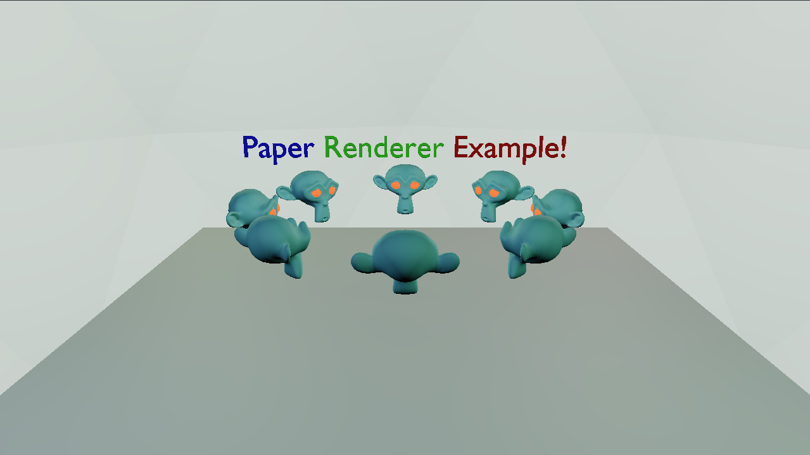

# PaperRenderer Example


This is an example that uses many of the features of PaperRenderer, including but not limited to:

- Model creation
- Model instance creation
- Material creation
- Material instance creation
- A Top Level Acceleration Structure (TLAS)
- Raster and Ray Tracing render passes
- Assigning model instances to Raster and Ray Tracing render passes, including their materials (per slot for raster)
- Custom image for a HDR rendering buffer
- A tonemapping pipeline built around a custom render pass that copies the HDR buffer to the current swapchain image
- Custom buffers for UBOs and storage buffers, including a point light buffer

Building the example is super simple as its just building the generated cmake files. Cmake copies all the resources needed automatically. The output files should look like the following tree below.

```markdown-tree
WORKING DIRECTORY
    resources
        shaders
            BufferCopy.spv
            Default_frag.spv
            Default_vert.spv
            IndirectDrawBuild.spv
            Quad.spv
            raytrace_chit.spv
            raytrace_rgen.spv
            raytrace_rmiss.spv
            raytraceShadow_rmiss.spv
            TLASInstBuild.spv
        models
            PaperRendererExample.glb

```

These are the main features that I decided were good abstractions for a renderer and therefore created. Overall, they create a good foundation for developing a mesh rendering application, especially one using ray tracing. While this example is mostly complete, it shouldn't necessarily be considered to as the overall cleanliness of it will improve, and more features will be showcased as I develop them. With that being said, it can still be used as a reference on how to generally develop around this renderer I created.

I am open to any suggestions on improving the example, especially since I understand it can be a little hard to look at and is at ~1500 lines